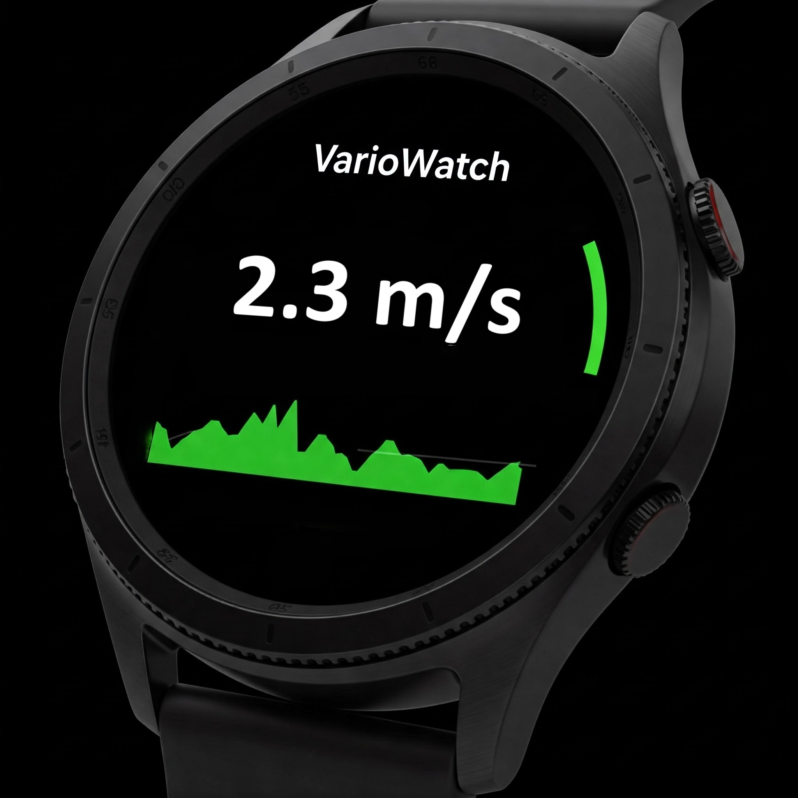

# VarioWatch

A Wear OS application that turns your smartwatch into a variometer for paragliding and hang gliding.

## Overview

VarioWatch uses your Wear OS device's barometric sensor to detect changes in atmospheric pressure, converting these readings into audio feedback that indicates vertical speed (climb or sink rate). This makes it a valuable tool for free flight sports like paragliding and hang gliding.

## Features

- **Real-time Vertical Speed Detection**: Measures atmospheric pressure changes to calculate vertical speed
- **Audio Feedback**: 
  - Higher frequency beeps indicate climbing
  - Lower frequency tones indicate sinking
  - Faster beep intervals for stronger lift
  - Continuous tone variation based on vertical speed
- **Wear OS Optimization**: 
  - Designed for glance-able information during flight
  - Battery-efficient sensor usage
  - Clear visibility in outdoor conditions

## Technical Details

### Hardware Requirements

- Wear OS device with barometric pressure sensor
- Compatible with Wear OS 3.0 and above
- Minimum 1GB RAM recommended

### Key Components

- **Barometric Sensor**: Measures atmospheric pressure at regular intervals
- **Vertical Speed Calculator**: Converts pressure changes into vertical speed measurements
- **Audio Generator**: Creates variable frequency tones based on vertical speed
- **User Interface**: Displays current vertical speed, altitude, and basic statistics

## Usage

1. Install the app on your Wear OS device
2. Launch VarioWatch
3. Wait for sensor calibration (approximately 5 seconds)
4. The app will begin providing audio feedback:
   - Ascending: Higher pitched beeps
   - Descending: Lower pitched tones
   - Level flight: Silent

## Safety Notice

This app is designed as an auxiliary tool for free flight sports. Never rely solely on this app for critical flight decisions. Always use certified flight instruments for primary flight data.

## Development

Built with:
- Kotlin
- Wear OS SDK
- Android Jetpack libraries
- Wear Compose for UI

Use Android Studio to run/debug on emulator

### Device Deploy

To deploy on Android watch, you need to 

1) Enable Developer Options on your watch
 - Go to Settings > About watch > Software information.
 - Tap Software version (or Build number on some Wear OS versions) seven times. You'll see a message saying "Developer mode turned on".
 - Go back to the main Settings menu, and you should now see Developer options. Tap it.
 - Enable ADB debugging. Confirm any prompts.
 - Enable Debug over Wi-Fi (Wireless debugging). Your watch needs to be connected to the same Wi-Fi network as your development computer. 

2) Pair your computer via ADB / wi-fi (only required once)
 - In Wireless debugging on your watch, click 'Pair new device'. Note the IP address and port displayed (e.g., 192.168.1.X:5555), and pairing code.
- On your computer terminal, navigate to your Android SDK's platform-tools directory (e.g., C:\Users\YourUser\AppData\Local\Android\Sdk\platform-tools) or ensure this directory is in your system's PATH.
 - Run `adb pair YOUR_WATCH_IP:PORT`. You will be requested to type the code.

3) Connect your computer via ADB
 - On your watch, under the Wireless debugging screen, note the IP address and Port listed below the device name. Should be a different port from the one used to pair.
 - Run on computer terminal: `adb connect YOUR_WATCH_IP:PORT` (the noted IP from last step).
 - Run `adb devices` to confirm your device is connected and ready to receive an app deployment. You should see the device in Android Studio as a selectable target to deploy and debug.

## License

See [License](LICENSE) file.

## Contributing

Contributions are welcome! Please feel free to submit a Pull Request.